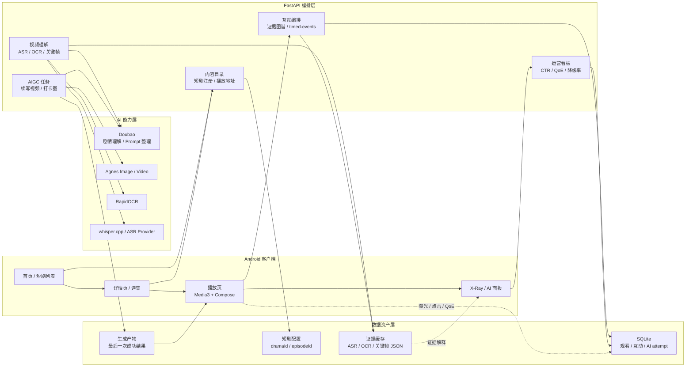

# 短剧剧情理解与即时互动系统

这是一个面向短剧场景的 AI 全栈项目，目标是把普通短剧播放器升级为“能理解剧情、能解释互动、能生成内容、能沉淀反馈数据”的互动观看系统。

项目包含 Android 客户端和 FastAPI 后端。后端负责短剧内容注册、视频理解、互动时间线、AIGC 生成、SQLite 数据闭环和运营指标；Android 端负责短剧列表、详情页、播放器、弹幕评论、互动卡片、X-Ray 证据层、AI 体验页和看板展示。

## 核心能力

- 多短剧接入：通过 `dramaId / episodeId` 管理短剧、分集、封面、播放地址、剧情简介和互动配置。
- 视频理解：融合 ASR、OCR、关键帧、弹幕热区和大模型摘要，生成剧情简介、互动候选和证据图谱。
- 证据驱动互动：互动节点带有 `evidenceRefs`、`generationSource`、`confidence`、`reviewStatus`，可解释“为什么这里适合互动”。
- 播放体验：Android 播放页支持弹幕、评论、点赞、分享、清屏播放、底部选集、上滑切集、长按 2 倍速和贴边互动卡片。
- AIGC 生成：支持剧情续写视频和打卡海报，用户可输入想看的方向，后端先整理 prompt，再调用生图/生视频模型。
- 可靠降级：远端模型失败、超时或返回异常时，回落本地模板和最后一次成功产物，避免演示链路中断。
- 数据闭环：观看进度、互动曝光、点击、跳过、收藏、QoE、AI 成功/降级状态写入 SQLite，用于运营看板统计。
- 多短剧扩展：新增短剧时只需要补注册配置、封面、分集、播放地址和可选证据缓存，不需要改 Android 主流程。

## 系统架构



## 技术栈

| 模块 | 技术 |
| --- | --- |
| Android | Kotlin、Jetpack Compose、Material3、Media3 / ExoPlayer |
| 后端 | Python 3.11、FastAPI、Uvicorn |
| 数据 | SQLite、JSON 证据缓存、Artifact 缓存 |
| 大模型 | Doubao / OpenAI 兼容调用方式 |
| 生图生视频 | Agnes Image / Agnes Video，经后端 Provider 封装 |
| OCR | RapidOCR ONNXRuntime |
| ASR | whisper.cpp 本地兜底，预留远端 ASR Provider |
| 媒体处理 | FFmpeg / FFprobe、HLS |
| 测试 | pytest、接口契约快照、Android Gradle 构建 |

## 目录结构

```text
android/                         Android Compose 客户端
  app/                            App 入口
  core/ui/                        通用主题与 UI 外壳
  feature/home/                   首页、详情页、播放器、AI 体验页

backend/
  app/
    main.py                       FastAPI 应用入口
    drama_registry.py             短剧注册表
    content_catalog.py            内容目录与兼容接口
    video_understanding_service.py 视频理解与证据持久化
    evidence_graph.py             证据图谱
    interaction_timeline.py       标准互动时间线
    interaction_components.py     互动组件 schema
    agnes_client.py               Agnes 客户端
    generation_task_service.py    AIGC 生成任务
    generated_asset_store.py      生成产物缓存
    runtime_sqlite_store.py       SQLite 运行时数据
    operations_dashboard.py       运营看板指标
  tests/                          后端单测与契约测试
  scripts/                        HLS 预处理、短剧注册等脚本

tools/                            本地分析脚本
ops/                              Docker / 环境示例
```

## 快速启动

### 1. 安装后端依赖

推荐使用项目内 Conda 环境：

```powershell
cd <project-root>
conda env create -p .\.conda\envs\aigc-backend -f backend\environment.yml
```

如果环境已存在，安装锁定依赖：

```powershell
.\.conda\envs\aigc-backend\python.exe -m pip install -r backend\requirements.lock.txt -r backend\requirements-dev.lock.txt
```

### 2. 启动后端

基础模式不依赖真实模型 key，可体验列表、详情、播放、互动、缓存和本地降级能力：

```powershell
.\.conda\envs\aigc-backend\python.exe -m uvicorn backend.app.main:app --reload --host 0.0.0.0 --port 8000
```

健康检查：

```powershell
Invoke-RestMethod http://localhost:8000/health
```

Android 模拟器访问宿主机后端地址：

```text
http://10.0.2.2:8000
```

### 3. 构建 Android

```powershell
cd <project-root>\android
.\gradlew.bat :app:assembleDebug --console=plain
```

### 4. APK 产物

仓库已包含当前打包好的 Debug APK，路径为：

```text
android/app/build/outputs/apk/debug/app-debug.apk
```

也可以按上一节命令重新构建生成同路径 APK。

## 主要接口

| 接口 | 用途 |
| --- | --- |
| `GET /health` | 健康检查 |
| `GET /home/recommend` | 首页推荐 |
| `GET /dramas/{drama_id}/episodes` | 分集列表 |
| `GET /episodes/{episode_id}/play` | 播放地址 |
| `GET /episodes/{episode_id}/interaction-nodes` | 旧版互动节点兼容接口 |
| `GET /episodes/{episode_id}/timed-events` | 标准互动时间线 |
| `GET /episodes/{episode_id}/evidence-graph` | 剧情证据图谱 |
| `POST /interaction/submit` | 提交互动反馈 |
| `GET /analytics/summary` | 互动 CTR、节点热度、AI 成功/降级率 |
| `POST /ai/content/recap` | 剧情简介生成/缓存 |
| `POST /ai/checkin-card` | 打卡图生成 |
| `POST /ai/generation/tasks` | AIGC 生成任务 |
| `GET /ai/generation/tasks/{task_id}` | 查询生成任务 |
| `GET /dashboard/operations` | 运营看板 |
| `GET /quality/evaluation` | AI 产物质量评测 |

## 新短剧接入方式

新增短剧时建议按以下流程处理：

1. 准备短剧目录、前几集视频和封面图，本地视频目录不提交 Git。
2. 在 `backend/app/dramas/` 增加短剧 JSON 配置，写入 `dramaId`、标题、封面、分集、播放地址和简介缓存。
3. 在 `drama_registry.py` 注册短剧配置，保持 `dramaId / episodeId` 唯一。
4. 如有弹幕数据，先使用脚本生成脱敏聚合热点 JSON，不提交原始 Excel。
5. 运行视频理解或简介预热，生成剧情简介、证据图谱和互动候选。
6. Android 端通过现有接口自动展示，不需要为每部短剧单独写页面。


## 当前限制

- 真实视频生成受远端模型排队、网络和公网图片 URL 可访问性影响，演示时必须保留本地模板兜底。
- Android 播放页功能较密集，后续仍可继续拆分播放器状态、面板、弹幕、互动组件和埋点模块。
- 质量评测目前以规则和固定样例为主，后续可加入 LLM-as-judge 与人工标注集。
- 新短剧接入已有注册表和配置约束，后续可进一步沉淀为命令行向导和自动预热流水线。
